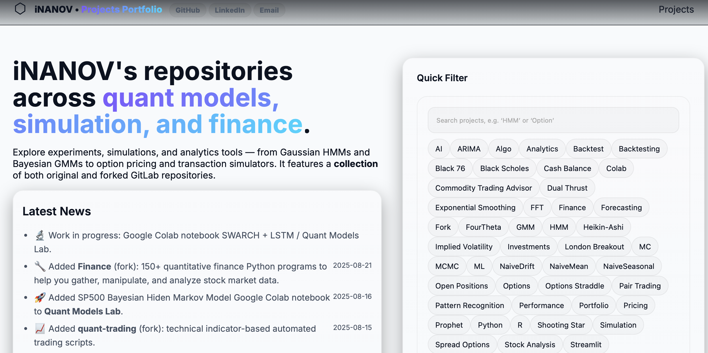

# iNANOV • Projects Portfolio

This repository contains the source code for my personal research portfolio website:  
👉 [https://inanov.github.io](https://inanov.github.io)

The site showcases experiments, simulations, and analytics tools across quantitative finance, including:

- **Quant Models Lab** – a curated playground of Colab notebooks for market regime detection. A curated playground of quantitative finance notebooks, each designed to be run directly in Google Colab. The goal is to make advanced modelling techniques for market data transparent, reproducible, and easy to extend.
- **TheBeeProject** – a Streamlit-based research project exploring AI-driven trading strategies, inspired by bee foraging behavior. It is not intended for commercial use. The repository is only used for Streamlit-based interactive analytics dashboard for evaluating options strategies. It visualises the outcome of server infrastructure that weekly tests tens of thousands of different classification models and technical features.
- Additional repositories and forks covering simulation, option pricing, and algorithmic trading.

---

## Preview

---

## License

This project is licensed under the terms of the [LICENSE](LICENSE.md) file in this repository.
